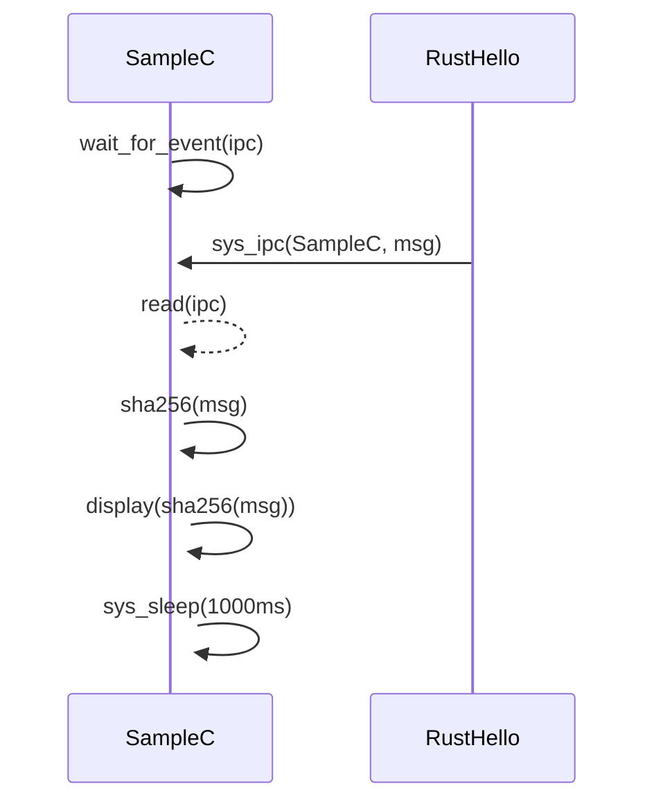

# Outpost sample project

## What this project does

This project hold two tasks:

   * A hello task written in Rust, holding a database of messages that are periodically emitted using IPCs to the other task
   * a sample task written in C, receiving IPC messages from hello, and calculating the sha256 hash for each received message

The sha256 hash is made using the OpenSource [libecc](https://github.com/libecc/libecc) project.

The exchange loop looks like the following:



This sample project aim to demonstrate a small and easy to upgrade project using both C and Rust applications that interact with each others.

You are free to copy, duplicate or modify these applications in the way you want for your own testing needs with respect for their licences.

## Basics

This is a sample Camelot-OS project that shows how to create a complete firmware for any personal needs, that include Camelot-OS kernel,
shield runtime, and multiple C and/or Rust applications.

A project is using three main parts:

   * a set of `config` files, using Kconfig syntax and used by each project component as input configuration
   * a `dts` file, that may include any `dtsi` file if needed, that define the project hardware configuration and also including the software-relevant memory related information, such as reserved memories, shared memories used by applications, etc.
   * a `project.toml` file, that describes overall project configuration and components.

In Camelot-OS project, the following components are supported:

   * a kernel, associated to the corresponding source and local config file
   * a runtime, associated to its own config file
   * one or more applications that need to be integrated

kernel and runtime are built first, and all other applications, as soon are built in parallel, able to access both kernel and runtime delivered artifacts.

## Quick start

Building this sample project is based on a reduced, easy to use, command sequence.

### Install outpost barbican python package

Barbican is the project manager that is responsible for orchestrating the overall

```console
pip install --user camelot-barbican
```

### Build project

```console
barbican download
barbican setup
cd output/build
ninja
```

### Deploy firmware

The firmware is then generated in `output/build/firmware.hex` file and can be flashed immediately.

## About project configuration file

The project configuration file is a TOML file that describes all required content that allows to produce a firmware for a given hardware target.

The file is separated into two main blocks:

   * a header, that list all project-wide informations
   * a list of softwares components

### Camelot-OS project-wide informations

| Field    | Value | Description |
| -------- | ----- | ------------- |
| name     | String | The project name |
| license  | SPDX identifier | The project license, in SPDX license identifier format. This also allow proprietary licenses |
| license_file | File path | File holding the project license content |
| dts      | File path | The Project-wide device tree file, that describes the hardware configuration and software memory mapping above it |
| crossfile | File path | full or relative locally acceded file path. meson cross-files standard path is also supported for relative |
| version   | Project version | free string format. Semversioning is recommended |

Here is an example of such a project header information list:

```toml
name = 'Dynamics demo Project'
license = 'Apache-2.0'
license_file = ['LICENSE.txt']
dts = 'dts/sample.dts'
crossfile = 'cm33-none-eabi-gcc.ini'
version = 'v0.0.1'
```

Once the header set, the project file hold three main declarative blocks, being the kernel, the runtime and one per-app definition.

### Kernel declaration

A Camelot project uses the Sentry kernel to execute project's task.
The kernel block is using the `[kernel]` block title and hold three information fields:

Here is a sample kernel block declaration:

| Field    | Value | Description |
| -------- | ----- | ------------- |
| scm.git.uri     | String | URI of the kernel repository |
| scm.git.revision | String | git revision of the kernel, being a hash, a tag or a label |
| config   | File path | path, relative to current project root dir, to the kernel config file. This file is a complete config file, generated by kconfig. It can be generated from a defconfig file when building the kernel in standalone mode |

```toml
[kernel]
scm.git.uri = 'https://github.com/camelot-os/sentry-kernel.git'
scm.git.revision = 'main'
config = 'configs/sentry/nucleo_u5a5.config'
```

### Runtime declaration

The Camelot-OS runtime is based on the Shield library. This runtime is **required** because it is responsible for holding the `_start` startup symbol for all tasks, and is also required in order to deliver all the glue and tooling that make tasks production easy, by including kconfig support for both C and Rust, delivers some easy to use symbols (like `printf()` or `println!()` symbols, and so on).
The runtime also delivers the system-wide compilation flags and link paths to help with applications production.

Camelot-OS runtime is defined as a standalone block so that all other applications can easily use it through an easy dependency model. C application can use the usual pkg-config based runtime discovery, while Rust app can directly use the project locally published crates, both  in the project `staging` directory just built during the production process (see *output directories hierarchy*).

The runtime block use the very same fields as the kernel block:

| Field    | Value | Description |
| -------- | ----- | ------------- |
| scm.git.uri     | String | URI of the shield runtime repository |
| scm.git.revision | String | git revision of shield, being a hash, a tag or a label |
| config   | File path | path, relative to current project root dir, to the shield config file. This file is a complete config file, generated by kconfig. It can be generated from a defconfig file when building shield in standalone mode |

```toml
[runtime]
scm.git.uri = 'https://github.com/camelot-os/shield.git'
scm.git.revision = 'main'
config = 'configs/shield/shield.config'
```

### Application declaration

In Camelot-OS, an application is a standalone repository that hold a userspace task. Application blocks are using the `application.<appname>` syntax in order to name the application block.

An application use the same initial fields as the other declarative blocks, but also hold application-specific fields.

| Field    | Value | Description |
| -------- | ----- | ------------- |
| scm.git.uri     | String | URI of the application repository |
| scm.git.revision | String | git revision, being a hash, a tag or a label |
| config   | File path | path, relative to current project root dir, to the applocation configuration. An application configuration hold a very short list of values, being application capabilities, scheduling information (priority, quantum and start and stop behavior) and basic memory requirements such as task size |
| build.backend | String | Application build backend, being `cargo` or `meson` |
| depends | String array | project-wide dependencies, being one of any other application `provides` field. This is useful if an application delivers a library that is used by others |
| provides | Path array | artifact delivered by a given application, the application binary (ELF file) being the one to start with |

A typical application configuration looks like the following:

```sh
#
# task properties
#
CONFIG_TASK_MAGIC_VALUE=0xdeadcafe
CONFIG_TASK_LABEL=0xC001F001

#
# Task configuration
#
CONFIG_TASK_PRIORITY=2
CONFIG_TASK_QUANTUM=2
CONFIG_TASK_AUTO_START=y
CONFIG_TASK_EXIT_NORESTART=y
# CONFIG_TASK_EXIT_RESTART is not set
# CONFIG_TASK_EXIT_PANIC is not set
CONFIG_TASK_STACK_SIZE=0x128
CONFIG_TASK_HEAP_SIZE=0x0

#
# Capabilities
#
CONFIG_CAP_DEV_BUSES=y
CONFIG_CAP_DEV_IO=y
# CONFIG_CAP_DEV_DMA is not set
# CONFIG_CAP_DEV_ANALOG is not set
# CONFIG_CAP_DEV_TIMER is not set
# CONFIG_CAP_DEV_STORAGE is not set
# CONFIG_CAP_DEV_CRYPTO is not set
# CONFIG_CAP_DEV_CLOCK is not set
# CONFIG_CAP_DEV_POWER is not set
# CONFIG_CAP_DEV_NEURAL is not set
# CONFIG_CAP_SYS_UPGRADE is not set
# CONFIG_CAP_SYS_POWER is not set
# CONFIG_CAP_SYS_PROCSTART is not set
# CONFIG_CAP_MEM_SHM_OWN is not set
# CONFIG_CAP_MEM_SHM_USE is not set
# CONFIG_CAP_MEM_SHM_TRANSFER is not set
# CONFIG_CAP_TIM_HP_CHRONO is not set
# CONFIG_CAP_CRY_KRNG is not set
# end of Capabilities
# end of task properties
```
Set the field in the way you wish to configure the application, so that the overall applications mapping, capabilities an scheduling matches your project's needs.
Note that each application hold a label. This label is required each time an application need to exchange data with another one. See the Sentry kernel [documentation](https://sentry-kernel.readthedocs.io/en/latest/uapi/model.html#task-handle) about handles for more information.

```toml
[application.hello]
scm.git.uri = 'https://github.com/camelot-os/sample-rust-app.git'
scm.git.revision = 'main'
config = 'configs/hello/hello.config'
build.backend = 'cargo'
depends = []
provides = ['hello.elf']
```

## Output directory hierarchy

Barbican is using a directory tree in order to store all the project-related dynamic content.

When starting with an empty project, only the above files (dts, config files and project.toml files) are kept.

Downloading the project toml components is made using the `barbican download` command.

This command initiate the output directory and deploy the projects component in the `output/src` subdir. This directory
use the application name used in the `project.toml` corresponding declaration block for each application source deployment.

Other important directories are:

   * `output/staging` that hold all the installable files that will be delivered successively at build time. Note that at `barbican setup` time,
     the Rust crates are deployed in this directory based on the runtime setup state, so that any Cargo application will be able to use these crates through the CARGO_HOME variable.
   * `output/build` that hold all the files that will be produced at build time


When running the `barbican setup` command, a `build.ninja` file is generated at the root of the `output/build` directory, responsible for building the overall project with proper dependencies, exploiting all the necessary information defined in the `project.toml` file and in all the components build systems definition. This file is responsible for orchestrating all the project build.

Building the overall project can then be made only by using the `ninja -C output/build` command. Project components are then built with respect for the inter-dependencies, and starting with the Sentry kernel and the Shield runtime.

All produced data are then stored in the `output/build` directory, starting with the `manifest.hex` generated file that can be directly used to flash the project board.

If needed, all generated files can be found in each component `output/build` corresponding subdir, and used for any debugging usage.
